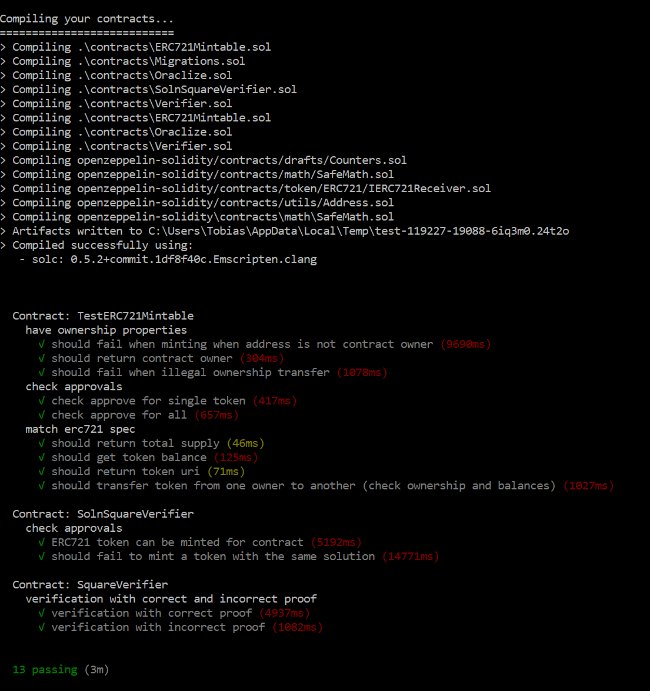
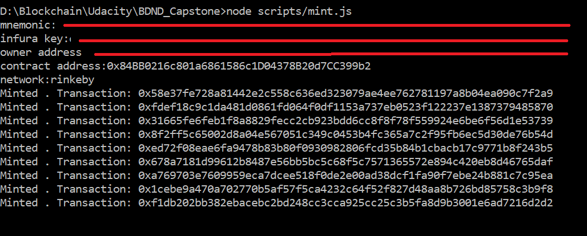

# Udacity Blockchain Capstone "Real Estate Marketplace"

Real Estate Marketplace is the capstone project for Udacity's Blockchain course. 

## Install

This repository contains Smart Contract code in Solidity (using Truffle), tests (also using Truffle)

To install, download or clone the repo, then:

`npm install`

In directory `eth-contracts/`  
`truffle compile`

## Tests
To run truffle tests:
In directory `eth-contracts/`

For all tests:    
`truffle test` 

All 13 tests should pass.



For single file tests:  
`truffle test test/TestERC721Mintable.js`  
`truffle test test/TestSquareVerifier.js`  
`truffle test test/TestSolnSquareVerifier.js`  

## Addresses and Links 
Contract address (Token) : [0x84BB0216c801a6861586c1D04378B20d7CC399b2](https://rinkeby.etherscan.io/address/0x84bb0216c801a6861586c1d04378b20d7cc399b2)  
Contract address (Verifier): [0xD45DDbccAE45e55a02E1b411B8a61a4cB94284Ca](https://rinkeby.etherscan.io/address/0xd45ddbccae45e55a02e1b411b8a61a4cb94284ca)  
OpenSea Marketplace Storefront link's: [Real Estate Exchange](https://rinkeby.opensea.io/category/realestateexchange)

## ZoKrates (generate zk-Snarks Validator)
#### Step 1: Run ZoKrates in Docker
``` 
docker run -v <path to your project folder>:/home/zokrates/code -ti zokrates/zokrates:0.3.0 /bin/bash
```

#### Change directory
``` 
cd code/zokrates/code/square/
``` 

#### Step 2: Compile the program written in ZoKrates DSL
``` 
../../../../zokrates compile -i square.code
``` 

#### Step 3: Generate the Trusted Setup
``` 
../../../../zokrates setup
```

#### Step 4: Compute Witness
``` 
../../../../zokrates compute-witness -a 3 9
```

#### Step 5: Generate Proof
```
../../../../zokrates generate-proof
```

#### Step 6: Export Verifier
```  
../../../../zokrates export-verifier
```

# Deploy to Rinkeby
Update <**your infura key**> and <**your contract owner address**> in 
`/eth-contracts/truffle-config.js` before migrate to Rinkeby Network. 
And create a `.secret` file in `/eth-contracts/` with your mnemonic.

Example `.secret` content:
```
make soup average fence better canvas house like mystery happy holiday
``` 
 
Start deployment
```
truffle migrate --network rinkeby
```

#Minting tokens
After deploying to the Rinkeby network, there will be a contract on Rinkeby that will be viewable on Rinkeby Etherscan. For example, here is a recently deployed contract. You should set this contract address and the address of your Metamask account as environment variables when running the minting script:

```
export MNEMONIC="<mnemonic>"
export INFURA_KEY="<infura_key>"
export OWNER_ADDRESS="<owner_address>"
export CONTRACT_ADDRESS="<deployed_contract_address>"
export NETWORK="rinkeby"

node scripts/mint.js
```

The output of the `mint.js` script should look like this.


# Project Resources

* [Remix - Solidity IDE](https://remix.ethereum.org/)
* [Visual Studio Code](https://code.visualstudio.com/)
* [Truffle Framework](https://truffleframework.com/)
* [Ganache - One Click Blockchain](https://truffleframework.com/ganache)
* [Open Zeppelin ](https://openzeppelin.org/)
* [Interactive zero knowledge 3-colorability demonstration](http://web.mit.edu/~ezyang/Public/graph/svg.html)
* [Docker](https://docs.docker.com/install/)
* [ZoKrates](https://github.com/Zokrates/ZoKrates)
